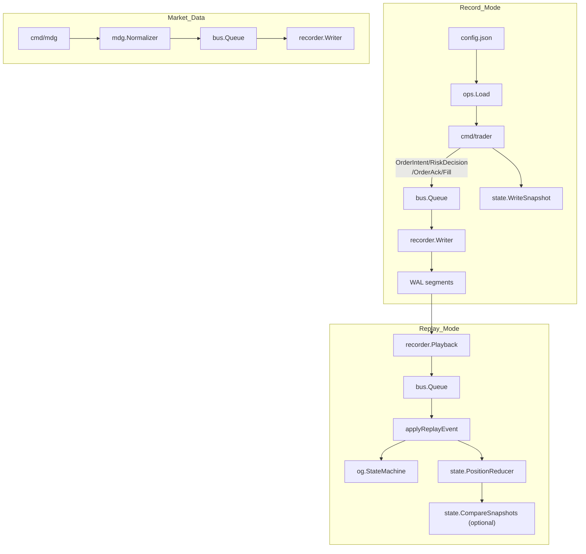
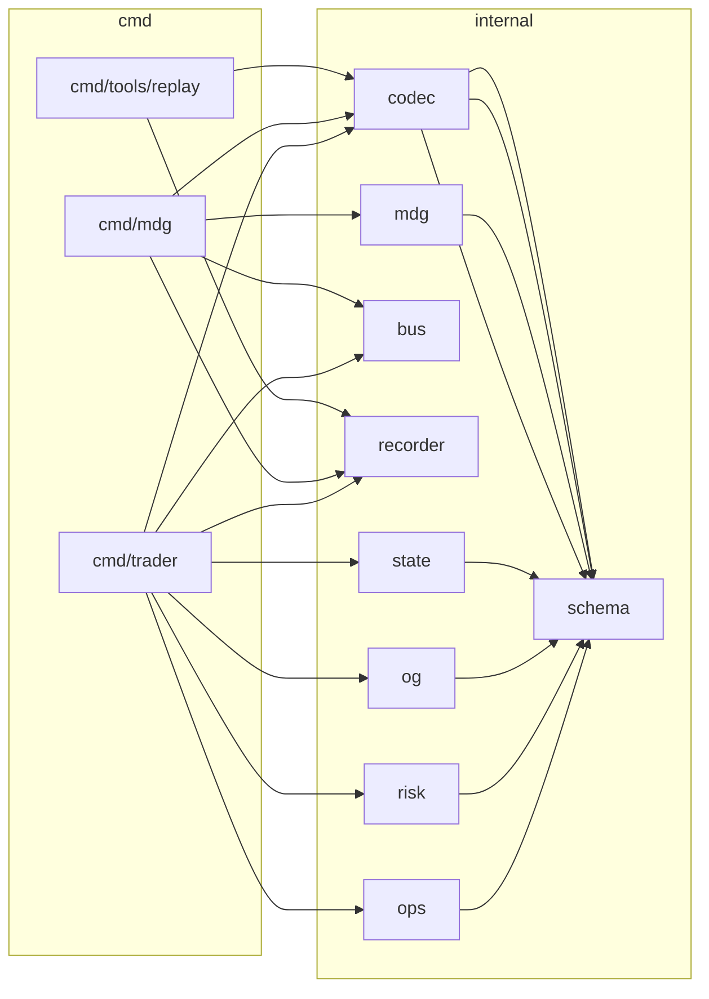

# go-hft

最小化的 HFT 事件管線沙盒，會將事件寫入 WAL，支援重播，並可從快照恢復部位。

## 專案結構

- `cmd/trader`: 訂單流模擬器，支援 WAL 記錄、快照寫入、重播與恢復。
- `cmd/mdg`: 行情資料產生器，將正規化 tick 寫入 WAL。
- `cmd/tools/replay`: WAL 回放工具，可選擇性解碼 payload。
- `internal/ops`: 設定載入與 registry 建構。
- `internal/schema`: 事件 schema、列舉與 payload 型別。
- `internal/codec`: 事件 payload 的二進位編解碼。
- `internal/recorder`: WAL 寫入/讀取/回放實作。
- `internal/bus`: 記憶體內、非阻塞事件佇列。
- `internal/og`: Stub 訂單閘道 + 訂單狀態機。
- `internal/risk`: 簡易風控引擎。
- `internal/state`: 部位歸約器、快照 IO 與恢復。
- `internal/mdg`: 行情資料產生/正規化。

## 需求

- Go 1.25.5+
- 無需環境變數

## 執行步驟

### 建置

```bash
go build -o bin/trader ./cmd/trader
go build -o bin/mdg ./cmd/mdg
go build -o bin/replay ./cmd/tools/replay
```

### 記錄模式（Trader）

```bash
./bin/trader \
  -wal-dir testdata/wal \
  -config config.json \
  -order-count 10 \
  -order-interval 50ms \
  -snapshot-path testdata/wal/positions.json
```

### 重播模式（Trader）

```bash
./bin/trader \
  -replay-dir testdata/wal \
  -replay-speed 1 \
  -replay-verify-snapshot=true \
  -replay-snapshot testdata/wal/positions.json
```

### 行情資料產生器（MDG）

```bash
./bin/mdg \
  -wal-dir testdata/wal \
  -config config.json \
  -ticks 100 \
  -interval 10ms \
  -kind quote
```

### WAL 回放工具

```bash
./bin/replay \
  -dir testdata/wal \
  -decode=true
```

## 部署步驟

1. 為目標環境建置執行檔（`go build`）。
2. 提供 JSON 設定檔（見下方）並建立 WAL 目錄。
3. 以 `-wal-dir` 與 `-config` 參數啟動 `trader` 進入記錄模式。
4. 可選擇啟用設定熱重載（`-config-reload-interval`）與快照（`-snapshot-path`）。
5. 若需要恢復，使用 `-recover` 並提供快照/WAL 相關參數啟動。

## 設定

設定檔為 JSON，由 `internal/ops` 載入。

### 範例 `config.json`

```json
{
  "registry": {
    "venues": [
      { "name": "SIM" }
    ],
    "symbols": [
      {
        "name": "TEST-USD",
        "venue": "SIM",
        "scale": {
          "PriceScale": 8,
          "QuantityScale": 8,
          "NotionalScale": 8,
          "FeeScale": 8
        }
      }
    ]
  },
  "risk": {
    "KillSwitch": false,
    "MaxOrderQty": 1000,
    "MaxOrderNotional": 1000000,
    "MaxPosition": 5000
  },
  "order": {
    "orderId": 1001,
    "strategyId": 1,
    "symbol": "TEST-USD",
    "side": 1,
    "type": 1,
    "timeInForce": 1,
    "price": 100,
    "qty": 10
  },
  "features": {
    "enableOrderFlow": true,
    "enableFills": true
  }
}
```

### 列舉對照（數值）

- `OrderSide`: `1=Buy`, `2=Sell`
- `OrderType`: `1=Limit`, `2=Market`
- `TimeInForce`: `1=GTC`, `2=IOC`, `3=FOK`
- `MarketDataKind`: `1=Trade`, `2=Quote`

### 備註

- 價格/數量為縮放後的整數；縮放比例由 `registry.symbols[].scale` 定義。
- `risk` 與 `scale` 欄位使用 struct 欄位名（JSON 對應不分大小寫）。
- 若省略 `-config`，`trader` 與 `mdg` 會使用內建預設值。

## WAL 格式

- 檔名規則：`<prefix>-<YYYYMMDD-HHMMSS>-<sequence>.wal`（預設 prefix：`wal`）
- 每筆記錄包含固定大小的標頭、payload 與 CRC32C checksum。
- 使用 `cmd/tools/replay` 檢視或解碼記錄。

## Mermaid 圖

### 專案流程



### 架構


