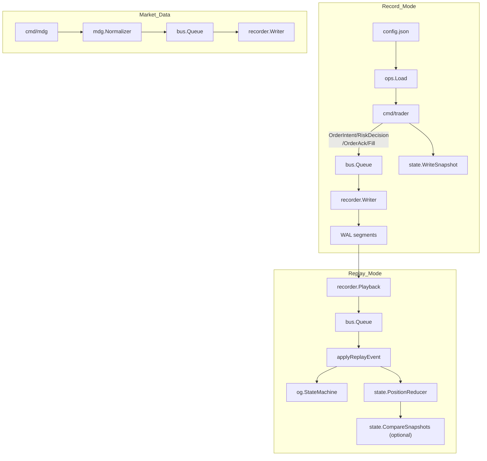
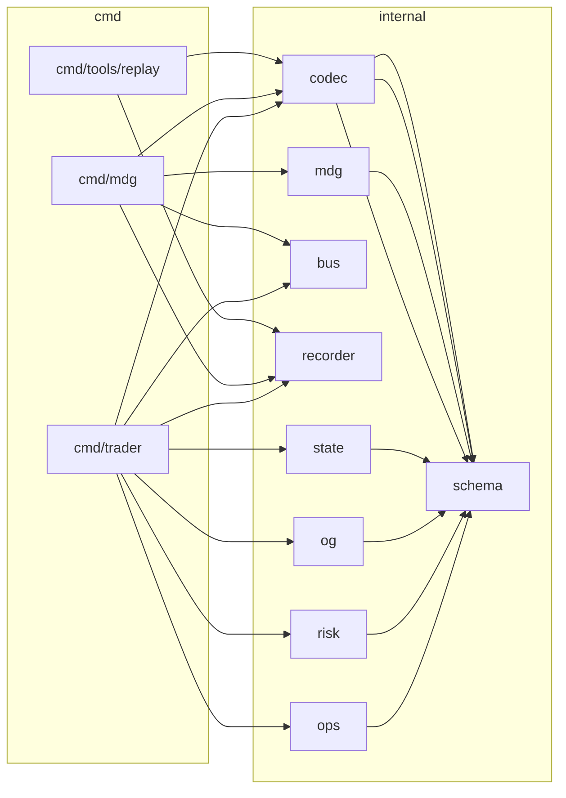

# go-hft

Minimal HFT event pipeline sandbox that records events to a WAL, supports replay, and can recover positions from snapshots.

## Project Layout

- `cmd/trader`: Order flow simulator with WAL recording, snapshot writing, replay, and recovery support.
- `cmd/mdg`: Market data generator that writes normalized ticks to the WAL.
- `cmd/tools/replay`: WAL playback tool with optional payload decoding.
- `internal/ops`: Config loading and registry construction.
- `internal/schema`: Event schema, enums, and payload types.
- `internal/codec`: Binary codecs for event payloads.
- `internal/recorder`: WAL writer/reader/playback implementation.
- `internal/bus`: In-memory, non-blocking event queue.
- `internal/og`: Stub order gateway + order state machine.
- `internal/risk`: Simple risk engine.
- `internal/state`: Position reducer, snapshot IO, and recovery.
- `internal/mdg`: Market data generator/normalizer.

## Requirements

- Go 1.25。5+
- No required environment variables

## Execution Steps

### Build

```bash
go build -o bin/trader ./cmd/trader
go build -o bin/mdg ./cmd/mdg
go build -o bin/replay ./cmd/tools/replay
```

### Record Mode (Trader)

```bash
./bin/trader \
  -wal-dir testdata/wal \
  -config config.json \
  -order-count 10 \
  -order-interval 50ms \
  -snapshot-path testdata/wal/positions.json
```

### Replay Mode (Trader)

```bash
./bin/trader \
  -replay-dir testdata/wal \
  -replay-speed 1 \
  -replay-verify-snapshot=true \
  -replay-snapshot testdata/wal/positions.json
```

### Market Data Generator (MDG)

```bash
./bin/mdg \
  -wal-dir testdata/wal \
  -config config.json \
  -ticks 100 \
  -interval 10ms \
  -kind quote
```

### WAL Replay Tool

```bash
./bin/replay \
  -dir testdata/wal \
  -decode=true
```

## Deployment Steps

1. Build binaries for the target environment (`go build`).
2. Provide a JSON config file (see below) and create the WAL directory.
3. Start `trader` in record mode with `-wal-dir` and `-config`.
4. Optionally enable config reload (`-config-reload-interval`) and snapshots (`-snapshot-path`).
5. If recovery is required, start with `-recover` and provide snapshot/WAL options.

## Configuration

The configuration file is JSON and is loaded by `internal/ops`.

### Example `config.json`

```json
{
  "registry": {
    "venues": [
      { "name": "SIM" }
    ],
    "symbols": [
      {
        "name": "TEST-USD",
        "venue": "SIM",
        "scale": {
          "PriceScale": 8,
          "QuantityScale": 8,
          "NotionalScale": 8,
          "FeeScale": 8
        }
      }
    ]
  },
  "risk": {
    "KillSwitch": false,
    "MaxOrderQty": 1000,
    "MaxOrderNotional": 1000000,
    "MaxPosition": 5000
  },
  "order": {
    "orderId": 1001,
    "strategyId": 1,
    "symbol": "TEST-USD",
    "side": 1,
    "type": 1,
    "timeInForce": 1,
    "price": 100,
    "qty": 10
  },
  "features": {
    "enableOrderFlow": true,
    "enableFills": true
  }
}
```

### Enum Reference (numeric)

- `OrderSide`: `1=Buy`, `2=Sell`
- `OrderType`: `1=Limit`, `2=Market`
- `TimeInForce`: `1=GTC`, `2=IOC`, `3=FOK`
- `MarketDataKind`: `1=Trade`, `2=Quote`

### Notes

- Prices/quantities are scaled integers; scaling is defined by `registry.symbols[].scale`.
- `risk` fields and `scale` fields use struct field names (case-insensitive JSON matching).
- If `-config` is omitted, `trader` and `mdg` use built-in defaults.

## WAL Format

- Segment naming: `<prefix>-<YYYYMMDD-HHMMSS>-<sequence>.wal` (default prefix: `wal`)
- Each record contains a fixed-size header, payload, and CRC32C checksum.
- Use `cmd/tools/replay` to inspect or decode records.

## Mermaid Diagrams

### Project Flow



### Architecture


