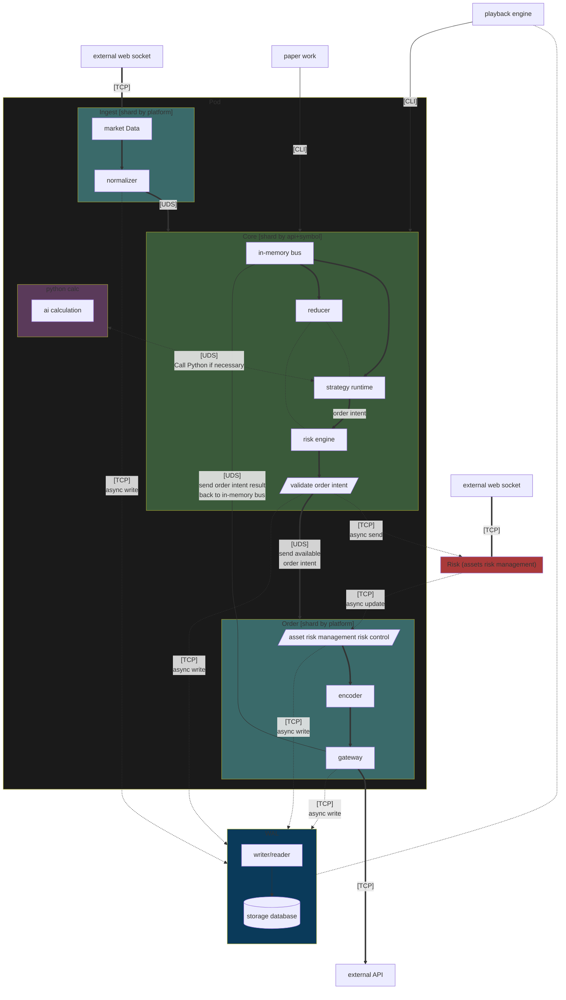

## Architecture

```mermaid
---
config:
    markdownAutoWrap: false
    flowchart:
        wrappingWidth: 1000
---

graph TB
    EWS[external web socket] ===|"[TCP]"| Ingest

    PPW[paper work]
    PBE[playback engine]
    PBE -....- WAL 
    PBE ----->|"[CLI]"| Core
    PPW ---->|"[CLI]"| Core

    subgraph Pod[Pod]
        direction TB %%

        style Pod fill:#1a1a1a
        subgraph Ingest["Ingest [shard by platform]"]
            direction TB %%
            style Ingest fill:#3a6a6a

            MKD[market Data]
            NML[normalizer]

            MKD ==> NML
        end

        NML ==>|"[UDS]"| Core

        subgraph Core["Core [shard by api+symbol]"]
            direction TB %%
            style Core fill:#3a5a3a
            
            IMB[in-memory bus]
            STG[strategy runtime]
            RSK[risk  engine]
            RKF[/validate order intent/]
            RDC[reducer]
            

            IMB ==> STG ==>|order intent| RSK
            IMB ==> RDC
            RDC -.- STG & RSK
            RSK ==> RKF
        end

        PY <-.->|"[UDS]
        Call Python if necessary"| STG

        subgraph PY["python calc"]
            direction TB %%
            style PY fill:#5a3a5a
            AI[ai calculation]
        end

        RKF ==>|"[UDS]
        send available 
        order intent"| Order

        subgraph Order["Order [shard by platform]"]
            direction TB %%
            style Order fill:#3a6a6a
            
            OFI[/asset risk management risk control/]
            OEN[encoder]
            OGW[gateway]

            OFI ==> OEN ==> OGW
        end
    end

    OGW ===>|"[TCP]"| EAPI
    EAPI[external API]


    EWS2[external web socket] ===|"[TCP]"| Risk
    RKF -.->|"[TCP]
    async send"| Risk -.->|"[TCP]
    async update"| OFI
    subgraph Risk["Risk (assets risk management)"]
        direction TB %%
        style Risk fill:#aa3a3a
    end


    
    NML -.->|"[TCP]
    async write"| WAL

    RKF -.->|"[TCP]
    async write"| WAL

    OFI -...->|"[TCP]
    async write"| WAL

    OGW -.->|"[TCP]
    async write"| WAL

    IMB ---|"[UDS]
    send order intent result 
    back to in-memory bus"| OGW
    subgraph WAL
        direction TB %%
        style WAL fill:#0a3a5a

        WR[writer/reader]
        DB[(storage database)]
        
        WR --> DB
    end
```