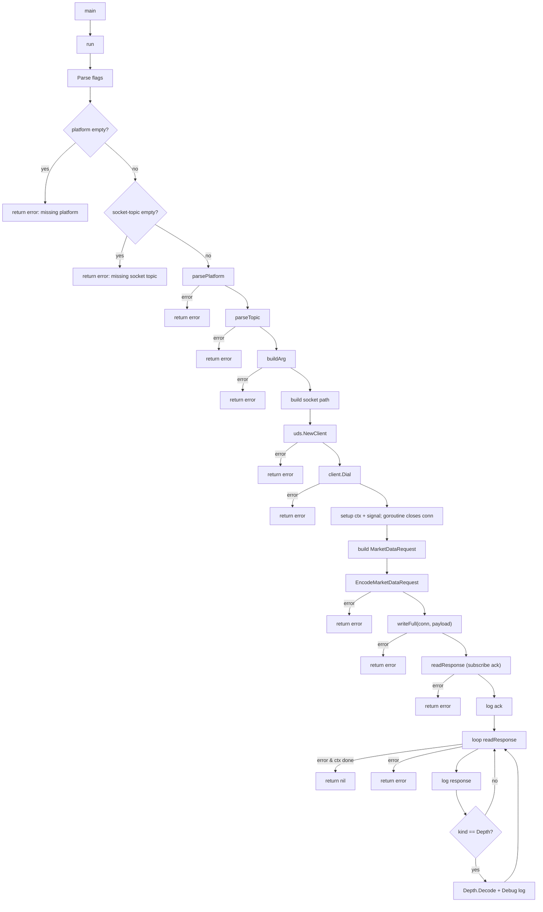
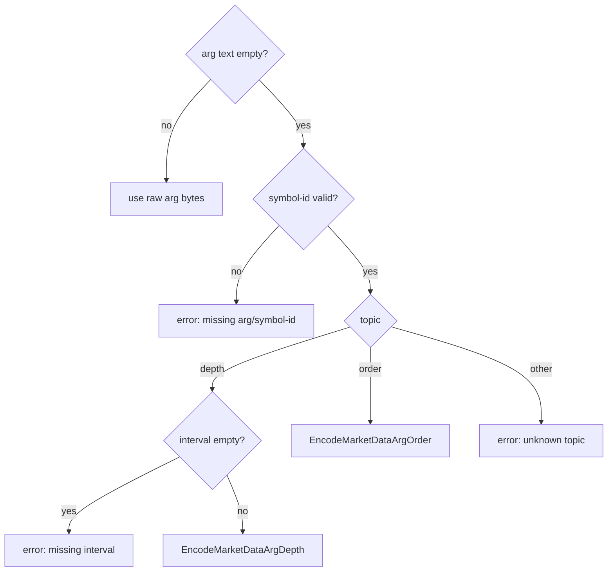
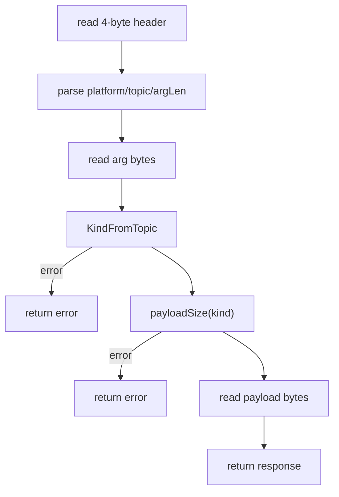
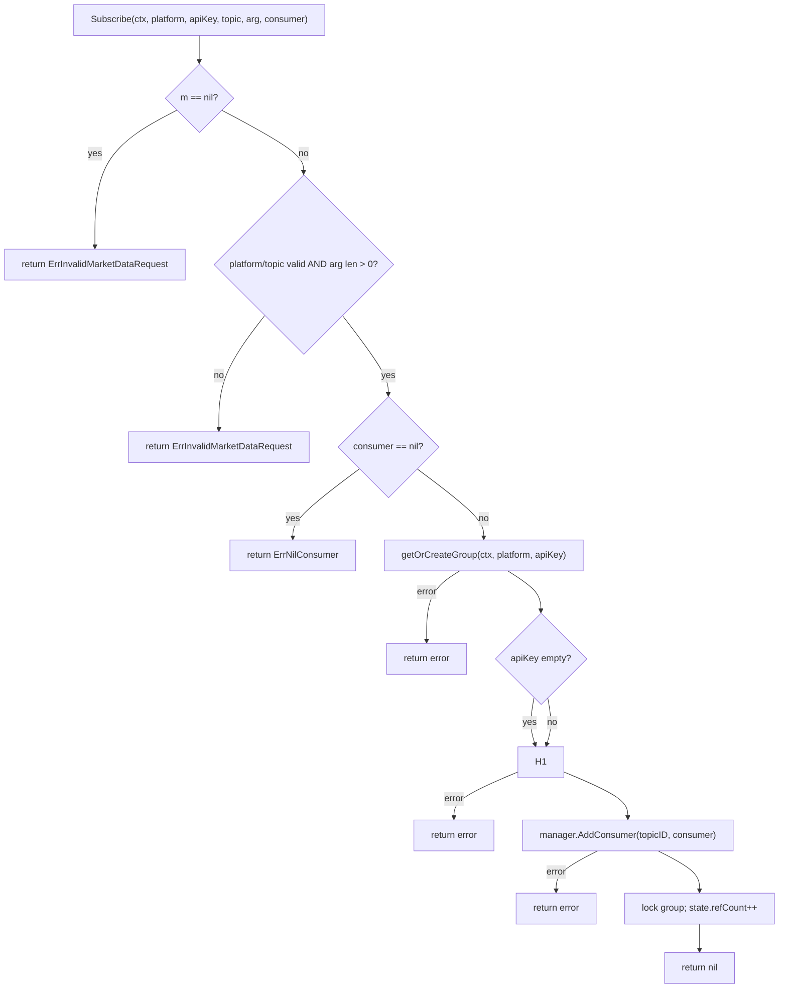
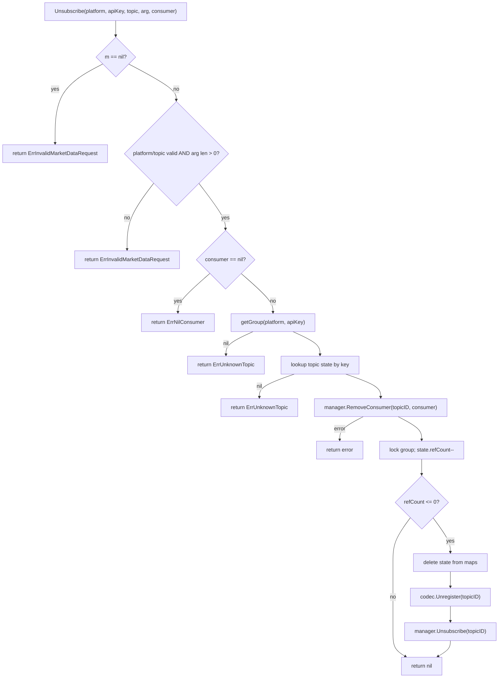
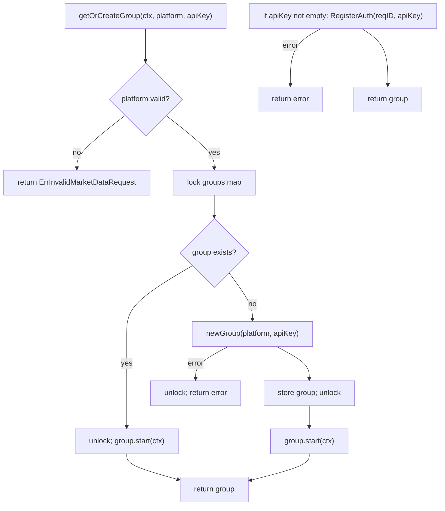
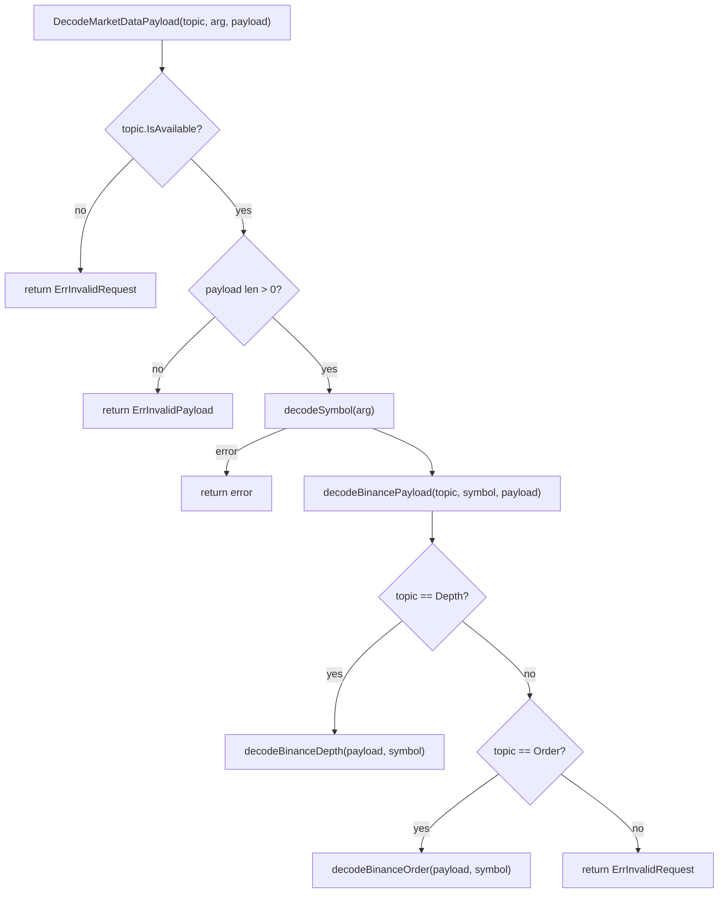
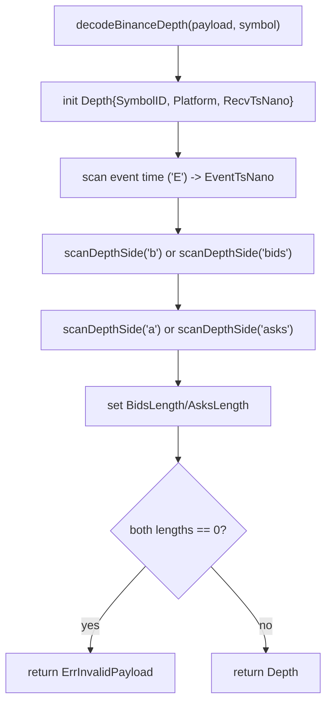
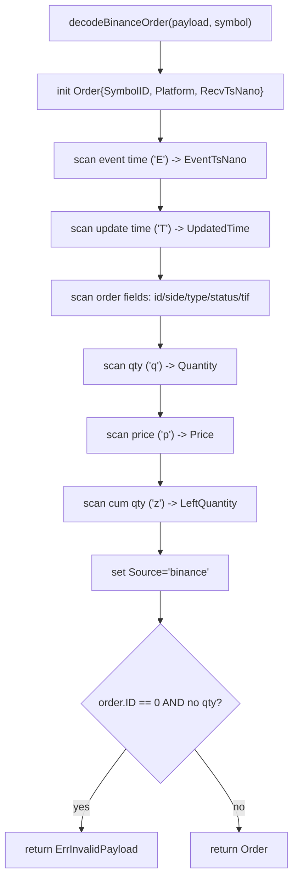

MarketData (internal/ingest/market_data.go) - Subscribe + group wiring

MarketData (internal/ingest/market_data.go) - Unsubscribe

MarketData (internal/ingest/market_data.go) - getOrCreateGroup

Binance payload (internal/ingest/binance/payload.go) - Decode dispatch

Binance payload (internal/ingest/binance/payload.go) - Depth parsing

Binance payload (internal/ingest/binance/payload.go) - Order parsing

